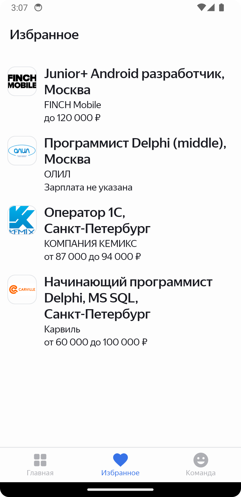

# Приложение для поиска вакансий
(Дипломный проект Яндекс.Практикума по курсу "Android-разработчик")

## Основной функционал

- Поиск вакансий через HeadHunters API
- Настройки фильтрации поиска по месту, отрасли, зп
- Просмотр найденных вакансий
- Библиотека избранных вакансий

## Используемый стек

- MVVM
- Coroutines
- SQLite (Room)
- Retrofit
- Jetpack Navigation
- Koin
- Glide

## Скриншоты

